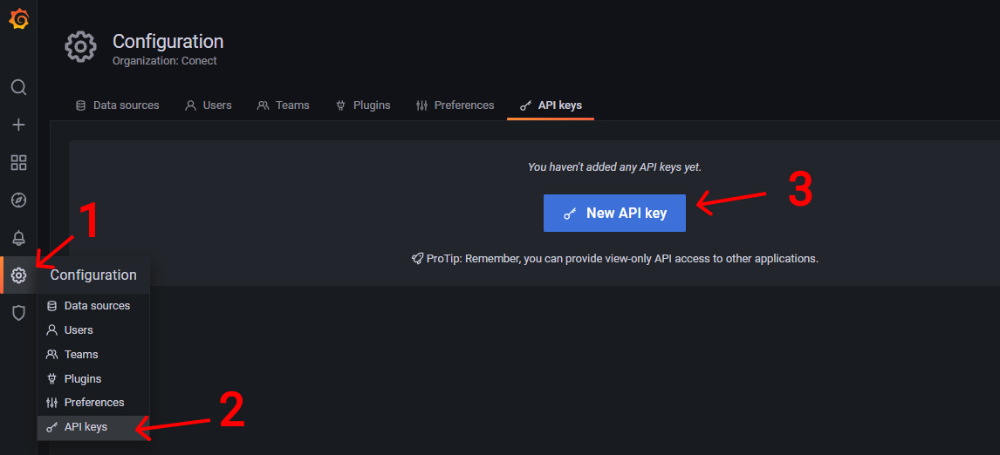
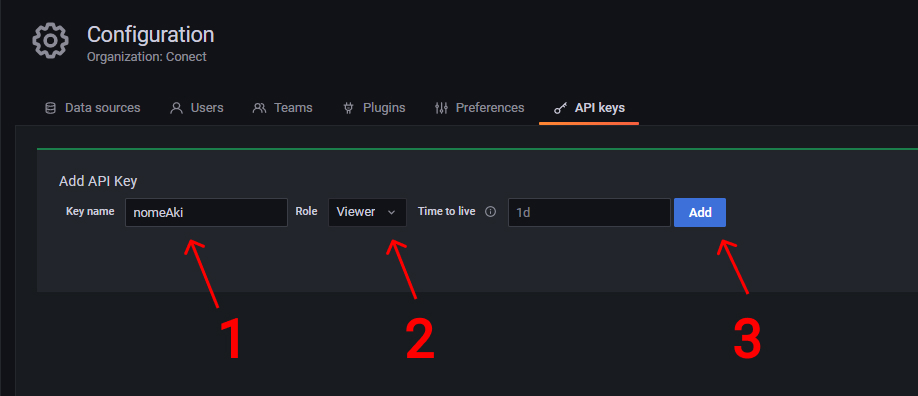
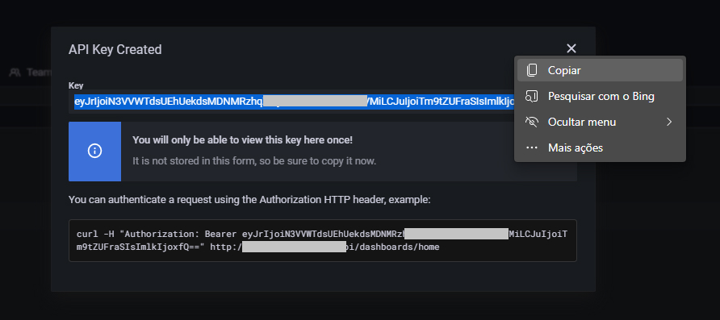
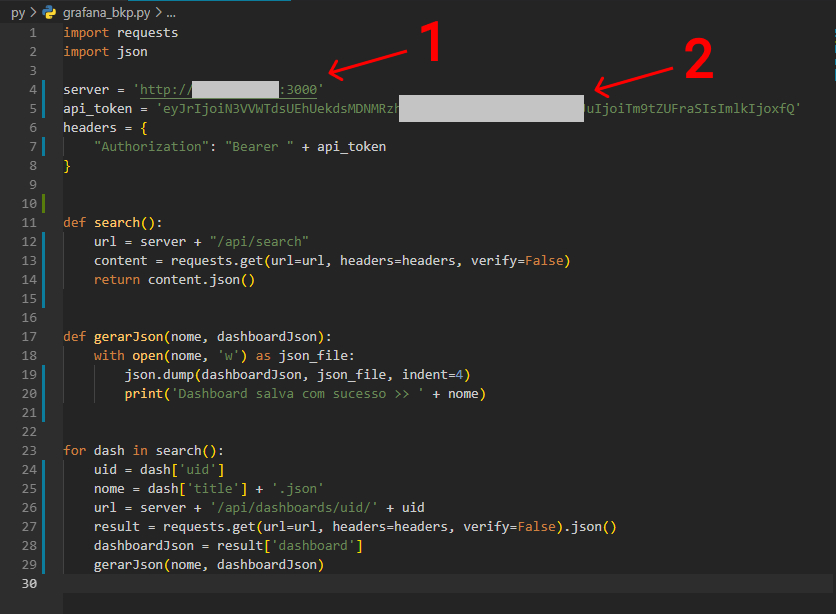
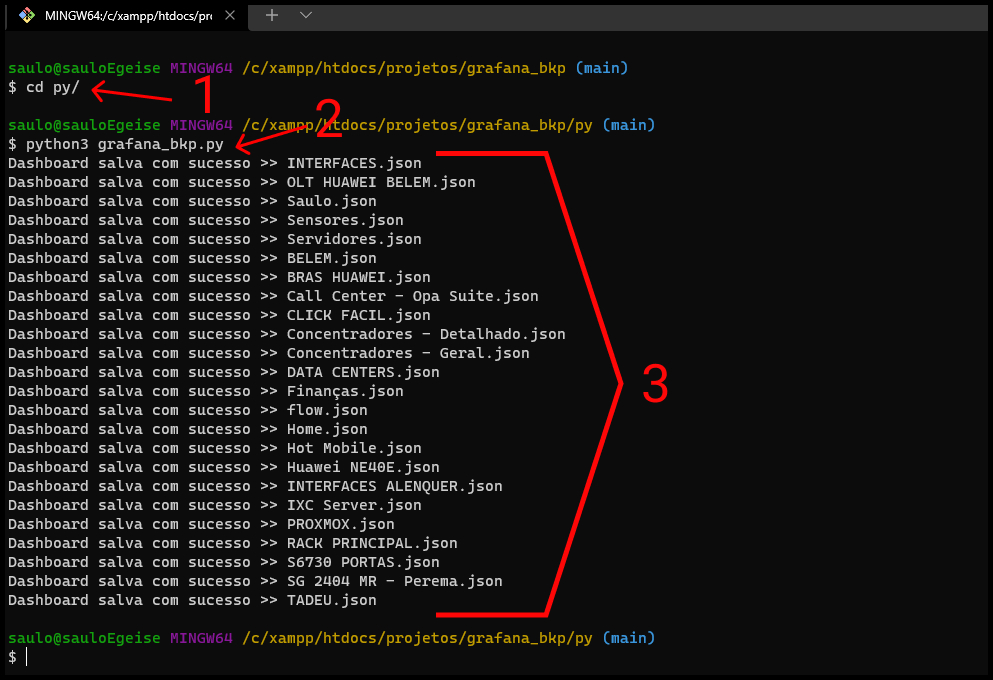

# Grafana - Backup de Dashborads

> backup de dashboards do grafana via api usando python

[MEU TELEGRAM](https://t.me/saulos2costa)

## APOIO

> video [Exportando dashboards do Grafana **"automagicamente"**](https://youtu.be/la64BA9YKWk) do [@robertsilvatech](https://github.com/robertsilvatech)


## 1 - Criando api token para o codigo

1) Configurações
2) API keys
3) New API keys



1) Dê um nome
2) Em rule pode ser tipo Viewer
3) Clique em Add



> Api Key criada. Agora é só copiar e gardar para usarmos no código script python que você pode baixar [AQUI](py/grafana_bkp.py).



> Vamos usar as libs **requests** e **json**.

```sh
pip3 install requests
```

1) Adicione o IP do ser servidor grafana
2) Adicione a Token Api



> Vamos rodar o script

1) Entre no diretório que está o script **grafana_bkp.py**
2) Rode o script: ```python3 grafana_bkp.py```
3) Se tudo estiver ok ele vai gerar um json para cada dashboard com uma mensagem mostrando o nome de casa uma.


